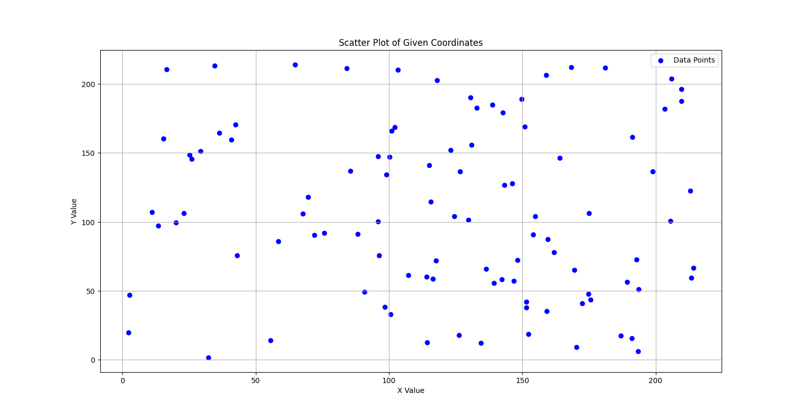
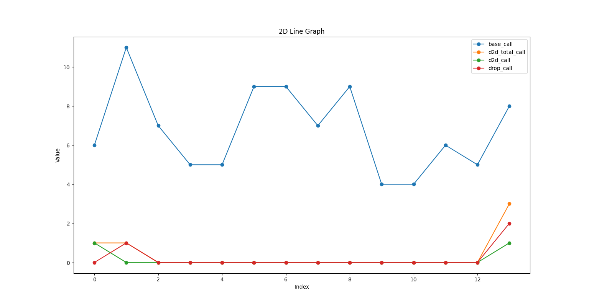
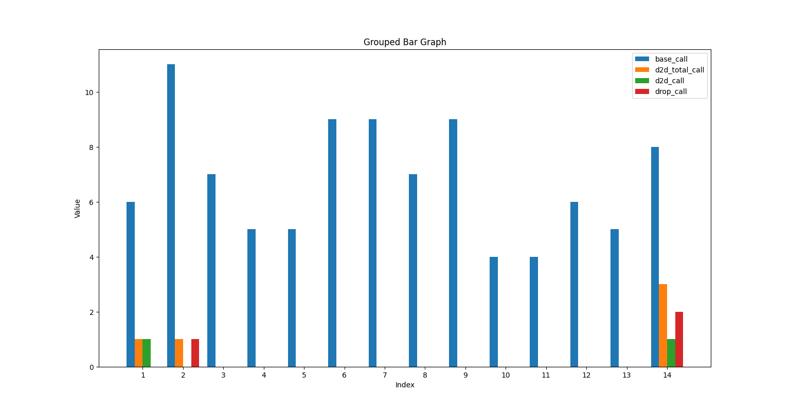

# call_simulation

coordinates of the devices:

comparisons of calls (base station calls, all device-to-device calls, complete device-to-device calls, drop calls)
* in 2D line graph:
  
* in groupes bar graph:
  
